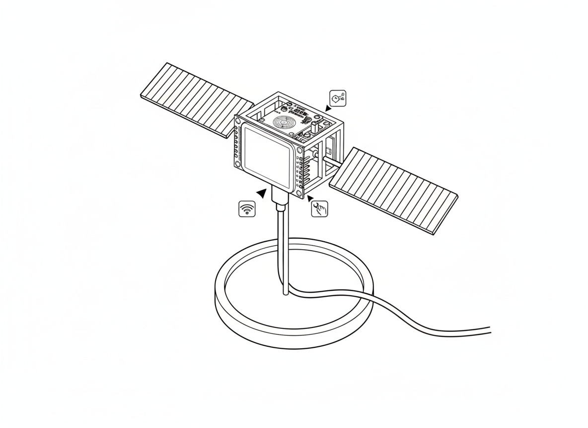

<p align="center">
  
</p>

# Weather Satellite

An ESP32-based desktop gadget that displays real-time temperature and humidity from its current location, along with a 3-day weather forecast at the touch of a button.

## Features

- **Real-time Indoor Climate**: Displays current temperature and humidity using an onboard AHT10 sensor
- **3-Day Forecast**: Shows weather forecast with icons, high/low temperatures fetched from AccuWeather
- **Touch Navigation**: Toggle between screens with a capacitive touch button
- **Time Display**: Large, easy-to-read clock with automatic NTP synchronization
- **Light Control**: Physical switch to enable/disable display backlight
- **Visual Feedback**: LED blinks to confirm touch interactions

## Hardware

### Components

| Component | Description |
|-----------|-------------|
| **ESP32-C3 SuperMini** | Main microcontroller (Lolin C3 Mini compatible) |
| **ST7789 TFT Display** | 240x280 pixel color LCD (rotated to 280x240 landscape) |
| **AHT10/AHT20 Sensor** | I2C temperature and humidity sensor |
| **TTP223B Touch Sensor** | Capacitive touch button for screen navigation |
| **Light Switch** | SPST switch for backlight on/off control |
| **LED** | Status/notification indicator |

### Recommended Parts

- [ESP32-C3 SuperMini](https://www.aliexpress.com/item/1005005967641936.html)
- [1.69" ST7789 240x280 TFT Display](https://www.aliexpress.com/item/1005004922900687.html)
- [AHT10 Temperature Humidity Sensor](https://www.aliexpress.com/item/4000125526498.html)
- [TTP223B Capacitive Touch Sensor](https://www.aliexpress.com/item/32896003629.html)

## Hardware Configuration

### Pin Definitions

| Pin | Function | Description |
|-----|----------|-------------|
| **GPIO 10** | TFT_CS | Display chip select |
| **GPIO 9** | TFT_DC | Display data/command |
| **GPIO 8** | TFT_RST | Display reset |
| **GPIO 7** | TFT_MOSI | Display SPI data |
| **GPIO 6** | TFT_SCLK | Display SPI clock |
| **GPIO 4** | I2C_SDA | AHT10 data line |
| **GPIO 3** | I2C_SCL | AHT10 clock line |
| **GPIO 2** | TOUCH | Capacitive touch input |
| **GPIO 21** | LIGHT_SW | Light switch input (LOW = on) |
| **GPIO 20** | BACKLIGHT | Display backlight (PWM) |
| **GPIO 0** | LED | Notification LED (PWM) |

### Wiring Diagram

```
ESP32-C3 SuperMini
├── SPI (Display)
│   ├── GPIO 10 → TFT CS
│   ├── GPIO 9  → TFT DC
│   ├── GPIO 8  → TFT RST
│   ├── GPIO 7  → TFT MOSI
│   └── GPIO 6  → TFT SCLK
├── I2C (Sensor)
│   ├── GPIO 4  → AHT10 SDA
│   └── GPIO 3  → AHT10 SCL
├── Controls
│   ├── GPIO 2  → TTP223B OUT
│   └── GPIO 21 → Light Switch (with internal pull-up)
└── Outputs
    ├── GPIO 20 → TFT Backlight
    └── GPIO 0  → Status LED
```

### Libraries

The project uses PlatformIO with the following libraries:

| Library | Version | Purpose |
|---------|---------|---------|
| Adafruit AHTX0 | ^2.0.5 | AHT10/AHT20 sensor driver |
| Adafruit GFX Library | ^1.11.9 | Graphics primitives |
| Adafruit ST7735 and ST7789 Library | ^1.10.4 | Display driver |
| ArduinoJson | ^7.2.1 | JSON parsing for API responses |

## Setup

### Initial Configuration

1. **Clone the repository** and open in PlatformIO

2. **Get an AccuWeather API Key**:
   - Sign up at [AccuWeather Developer Portal](https://developer.accuweather.com/)
   - Create a new app to get your API key

3. **Configure the device** by editing the configuration section at the top of `src/main.cpp`:

   ```cpp
   const char *WIFI_SSID = "your_wifi_network";
   const char *WIFI_PASSWORD = "your_wifi_password";
   const char *LOCATION_POSTAL_CODE = "your_postal_code";
   const char *ACCUWEATHER_API_KEY = "your_api_key";
   const bool USE_CELSIUS = false;  // true for Celsius, false for Fahrenheit
   const bool USE_24_HOUR = false;  // true for 24-hour, false for 12-hour
   ```

4. **Upload the firmware** using PlatformIO

### WiFi Setup (Captive Portal)

On first boot or when WiFi credentials are not configured, the device will:

1. Create a WiFi access point named `WeatherSatellite-Setup`
2. Display connection instructions on the screen
3. Connect to this network with your phone or computer
4. A captive portal will open automatically
5. Enter your WiFi credentials, postal code, and AccuWeather API key
6. The device will save settings and reboot

### Display Screens

- **Screen 1 (Default)**: Shows current time, indoor temperature, and humidity
- **Screen 2**: Shows 3-day weather forecast with icons and high/low temps

Touch the capacitive button to toggle between screens.

## Troubleshooting

### Factory Reset

If you need to reset the device configuration:

1. Power off the device
2. **Hold the touch button** while powering on
3. Continue holding for 5 seconds until the LED blinks rapidly
4. The device will clear all saved settings and restart in setup mode

### Common Issues

| Issue | Solution |
|-------|----------|
| **Display stays black** | Check SPI wiring, verify TFT_RST connection |
| **No temperature reading** | Verify I2C wiring (SDA/SCL), check AHT10 address |
| **WiFi won't connect** | Confirm SSID/password, ensure 2.4GHz network |
| **Forecast not loading** | Verify API key, check postal code format |
| **Time incorrect** | Device syncs via NTP; ensure WiFi is connected |
| **Touch not responding** | Check GPIO 2 connection, verify TTP223B power |
| **Temperature reads high** | Sensor self-heating; mounted away from heat sources |

### Serial Debug

Connect via USB and open serial monitor at **115200 baud** to see debug output:

```bash
pio device monitor
```

The device logs WiFi status, sensor readings, API responses, and error messages.

### Temperature Calibration

The AHT10 sensor may read slightly high due to self-heating. The code includes a calibration offset:

```cpp
const float TEMP_OFFSET_F = -6.0;  // Adjust as needed
```

Modify this value in `src/main.cpp` to calibrate for your specific sensor.

## Building

### Prerequisites

- [PlatformIO](https://platformio.org/) (VS Code extension or CLI)
- USB-C cable for programming

### Build & Upload

```bash
# Build the project
pio run

# Upload to device
pio run --target upload

# Monitor serial output
pio device monitor
```

## License

MIT License - Feel free to modify and use for your own projects.
